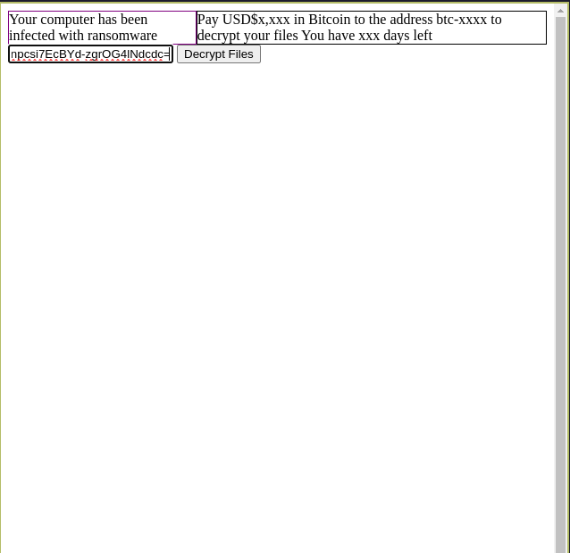

# Yet Another Ransomware Demo (YARD)

## Introduction
WARNING: Educational Purposes Only

This repository contains a proof-of-concept ransomware implementation. It is intended for educational purposes only and should never be used in a real-world environment. Running this code on a system you don't have explicit permission to modify could result in data loss or system damage.

## Dependencies
- Python
- Virtualenv
- Make

```sh
# to setup the virtualenv (venv)
# note: you should have venv installed before running this
make setup
```

## Monorepo
This project is a mono-repo of 3 components
1. apache-httpd - Contains the configs and Dockerfiles to build a vulnerable apache httpd 2.4.49 server susceptible to remote code execution
2. attacker - Contains the ransomware attacker's public key, private key and helper scripts
3. ransomware - Contains the ransomware's source code

## Usage
#### Encryption
Note that by default, this project will run the ransomware demo against the `os_root` directory in its current directory.
You can generate an fake `os_root` directory using:
```sh
# generate the fake os_root dir
make mock-gen

# view the contents of the files in the fake os_root dir
make mock-view
```

Before the attack can happen, the attacker will need to generate an RSA key pair:
```sh
# generate the attacker's keys
make attacker-keygen

# to check the keys generated
ls attacker
# stdout:
# ... public_key.pem private_key.pem
```

With the attacker's public key, we can now start the ransomware demo with:
```sh
# to run the demo
make run

# or you could also build the demo as a binary file and run it
make build
./main
```

Running the demo does the following:
1. Generates a Symmetric Key
2. Encrypts the Symmetric Key with the attacker's public key (uses `attacker/public-key.pem` by default, can be changed with `--pub` flag) and saves it in the current directory as a file called `key`
3. Encrypt the files with the Symmetric Key generated in Step 1
4. Show Ransom UI

After the demo has ran, you are free to close the UI, as you can re-open it with `./main` or `make run` again. This command checks for the `key` file and if it exists, it wouldn't run the encryption again.

#### Decryption
To decrypt the files that have been encrypted, you will need to send the contents of the `key` file to the attacker when making payment.

The attacker would then decrypt the `key` file's contents with their `private_key.pem`.
To simulate this happening, you can run:
```sh
# simulate attacker decrypting the key
make attacker-decrypt
# stdout:
Decrypted contents: n1f6E3RofoXlIeUFP2onpcsi7EcBYd-zgrOG4lNdcdc=
```

With the key e.g: `n1f6E3RofoXlIeUFP2onpcsi7EcBYd-zgrOG4lNdcdc=`, we would enter this key into the textbox in the GUI and press the decrypt button.


## Development
This demo was built on a ubuntu-amd64-18.06 VM. There is no guarantee support for other OSes
You can find the setup script for an ubuntu-amd64-18.06 VM that installs all the dev dependencies at `ubuntu-dev-setup.sh`
